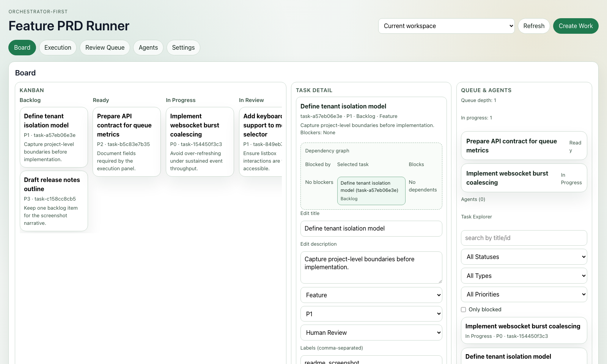

# Feature PRD Runner - Web Dashboard

> **Status (2026-02-11):** Current frontend setup/development guide.
> **Product direction:** [`../docs/ORCHESTRATOR_FIRST_REVAMP_PLAN.md`](../docs/ORCHESTRATOR_FIRST_REVAMP_PLAN.md)
> **Docs index:** [`../docs/README.md`](../docs/README.md)

Modern web dashboard for monitoring and controlling Feature PRD Runner.

## Homepage



## Setup

### Prerequisites

- Node.js 18+ and npm
- Backend server running (see main README)

For the backend, if you prefer `uv`, you can install the server extra with:

```bash
uv pip install 'feature-prd-runner[server]'
```

### Installation

```bash
cd web
npm install
```

### Development

Start the development server:

```bash
npm run dev
```

The dashboard will be available at http://localhost:3000

The backend API should be running at http://localhost:8080

### Tests

Run unit/integration tests (Vitest):

```bash
npm test
```

Optional:

```bash
npm run test:ui
npm run test:coverage
```

Run real-server browser smoke tests (Playwright):

```bash
npx playwright install chromium
npm run e2e:smoke
```

`e2e:smoke` starts both backend (`:8080`) and frontend (`:3000`) automatically.

Regenerate the homepage screenshot with seeded tasks across board stages:

```bash
npm run screenshot:homepage
```

### Production Build

Build for production:

```bash
npm run build
```

Preview production build:

```bash
npm run preview
```

## Features

- **Real-time Updates**: WebSocket-based live updates for runs and logs
- **Project Overview**: Current status, progress, and task breakdown
- **Tasks & Runs**: Tables for tasks and recent runs
- **Phase Timeline**: Visual timeline of all phases with dependencies
- **Live Logs**: Streaming logs from active runs
- **Metrics Panel**: API usage, costs, timing, and code changes
- **Controls**: Retry, skip, resume, stop
- **Approvals**: Pending approvals with approve/reject + feedback
- **File Review**: Per-file approve/reject flow with diffs
- **Breakpoints**: Create/toggle/delete/clear breakpoints
- **Chat**: Send guidance/requirements/corrections during a run
- **Auth (Optional)**: Token-based login when enabled on the server
- **Multi-Project**: Select a discovered `.prd_runner` project

## Architecture

### Frontend

- **Framework**: React 18 with TypeScript
- **Build Tool**: Vite
- **Styling**: Plain CSS with modern features
- **State Management**: React hooks (useState, useEffect)

### API Integration

The frontend connects to the FastAPI backend:

- REST API (`/api/*`) for data fetching
- WebSocket (`/ws/*`) for real-time updates

See `vite.config.ts` for proxy configuration.

## Components

### RunDashboard

Main overview showing:
- Phase completion progress
- Task status breakdown
- Current phase/task
- Last error (if any)

### PhaseTimeline

List of all phases with:
- Status (pending, running, done, blocked)
- Dependencies
- Progress bars

### LiveLog

Real-time log streaming:
- WebSocket connection
- Auto-scrolling
- Connection status indicator

### MetricsPanel

Metrics display:
- API calls and token usage
- Estimated costs
- Wall time
- Code changes (files, lines added/removed)

## Development Notes

### Polling

The dashboard uses polling for status and phases (every 5 seconds) as a fallback. WebSocket is used for real-time log streaming.

For better performance, consider implementing WebSocket for all real-time data in a future iteration.

### Error Handling

All API calls include error handling and display user-friendly error messages when the backend is unavailable.

### Responsive Design

The dashboard is responsive and works on mobile devices, tablets, and desktops.

## Future Enhancements

- [ ] Dark theme
- [ ] Export reports (PDF, CSV)
- [ ] Email/Slack notifications
- [ ] WebSocket for all realtime panels (status/tasks/phases)
- [ ] Expand E2E scenarios beyond smoke coverage
